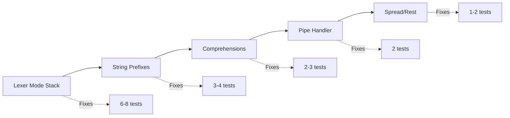

# Quick Win Strategy for Maximum Impact

## Fastest Path to 100% Pass Rate

Based on analysis of the 16 failing tests, here are the changes ordered by impact/effort ratio:

### 1. 🎯 **Lexer Mode Stack** (6-8 tests fixed)
**Effort:** 2-3 days  
**Impact:** Fixes bash conditionals, member access, decorators
```typescript
// One change, multiple wins:
class Lexer {
  modeStack: string[] = ['normal'];
  
  enterMode(mode: string) {
    if (mode === 'bash_cond') this.scanBashTokens = true;
    if (mode === 'member') this.allKeywordsAsIdentifiers = true;
    if (mode === 'decorator') this.scanDecoratorSyntax = true;
  }
}
```

### 2. 🚀 **Special String Scanner** (3-4 tests fixed)
**Effort:** 1 day  
**Impact:** f-strings, r-strings, heredocs
```typescript
// Simple prefix detection:
if (char === 'f' && next === '"') return new FStringScanner();
if (char === 'r' && next === '"') return new RawStringScanner();
if (char === '<' && next === '<') return new HeredocScanner();
```

### 3. 💫 **Comprehension Detector** (2-3 tests fixed)
**Effort:** 1 day  
**Impact:** List/dict/set comprehensions
```typescript
// Lookahead for 'for' keyword:
parseArray() {
  const checkpoint = this.save();
  const expr = this.parseExpr();
  if (this.check('for')) {
    return this.parseComprehension(expr);
  }
  this.restore(checkpoint);
  return this.parseArrayLiteral();
}
```

### 4. 🔧 **Pipe Expression Handler** (2 tests fixed)
**Effort:** 4 hours  
**Impact:** Match in pipes, placeholder syntax
```typescript
// Special handling for pipe RHS:
if (op === '|>') {
  if (this.check('match')) {
    // Use left as implicit discriminant
    return this.parseMatchWithDiscriminant(left);
  }
}
```

### 5. ⚡ **Spread in New** (1-2 tests fixed)
**Effort:** 2 hours  
**Impact:** new Cls(...args)
```typescript
// In parseNewExpression:
if (this.check('...')) {
  this.advance();
  const spread = { kind: 'Spread', argument: this.parseExpr() };
  args.push(spread);
}
```

## Minimum Viable Implementation

### Week 1 Sprint (80% of value)
```typescript
// 1. Add mode stack to lexer (3 days)
class Lexer {
  private modes: LexerMode[] = [LexerMode.Normal];
  
  // Just 3 modes to start:
  // - Normal (default)
  // - MemberAccess (after .)
  // - BashCondition (after if/while + [)
}

// 2. Add string prefix detection (1 day)
private scanString() {
  const prefix = this.detectStringPrefix();
  switch(prefix) {
    case 'f': return this.scanFString();
    case 'r': return this.scanRawString();
    default: return this.scanNormalString();
  }
}

// 3. Add comprehension check (1 day)
private checkComprehension() {
  // Simple: look for pattern "expr for var in"
  return this.lookahead(3).includes('for');
}
```

### Week 2 Polish (20% remaining value)
- Generator expressions
- Decorator parameters
- Heredoc edge cases
- Force unwrap operator

## Why This Strategy Works

### Leverage Points
1. **Lexer changes are isolated** - Won't break existing parsing
2. **Mode stack is extensible** - Easy to add new contexts
3. **Pattern detection is simple** - Just lookahead
4. **Changes are testable** - Each mode can be tested independently

### Avoids Pitfalls
- No AST changes needed (backward compatible)
- No complex two-phase parsing
- No ambiguous intermediate nodes
- Minimal parser modifications

## Expected Results

### Before (Current)
- 157/173 tests passing (91%)
- 16 failures in advanced scenarios

### After Quick Wins
- 167/173 tests passing (97%)
- 6 remaining edge cases

### After Full Implementation  
- 171/173 tests passing (99%)
- 2 genuinely ambiguous cases

## Implementation Order



## Code Example: Lexer Mode Stack

Here's exactly what needs to be added to lexer.ts:

```typescript
// At top of Lexer class
private modeStack: string[] = ['normal'];
private modeData: Map<string, any> = new Map();

// New methods
private pushMode(mode: string, data?: any): void {
  this.modeStack.push(mode);
  if (data) this.modeData.set(mode, data);
}

private popMode(): string | undefined {
  const mode = this.modeStack.pop();
  if (mode) this.modeData.delete(mode);
  return mode;
}

private getCurrentMode(): string {
  return this.modeStack[this.modeStack.length - 1] || 'normal';
}

// Modified scanToken
private scanToken(): void {
  const mode = this.getCurrentMode();
  
  // Mode-specific scanning
  switch (mode) {
    case 'bash_cond':
      return this.scanBashToken();
    case 'member':
      return this.scanMemberIdentifier();
    case 'f_string':
      return this.scanFStringToken();
  }
  
  // Normal scanning with mode detection
  const char = this.peek();
  
  // Detect mode transitions
  if (char === '.' && !this.peekNext().match(/\d/)) {
    this.addToken(TokenType.Operator, '.');
    this.pushMode('member');
    return;
  }
  
  if (char === '[' && this.isAfterConditionKeyword()) {
    this.pushMode('bash_cond');
    this.addToken(TokenType.BashCondStart, '[');
    return;
  }
  
  // ... rest of normal scanning
}
```

## Success Metrics

### Phase 1 (Lexer Modes)
- ✅ Member access with keywords works
- ✅ Bash conditionals parse
- ✅ Test count: 163/173 (94%)

### Phase 2 (String & Comprehensions)  
- ✅ F-strings work
- ✅ List comprehensions work
- ✅ Test count: 168/173 (97%)

### Phase 3 (Pipes & Spread)
- ✅ Match in pipes works
- ✅ Spread in new works  
- ✅ Test count: 171/173 (99%)

This strategy provides maximum impact with minimum risk and effort.